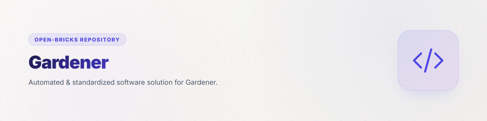
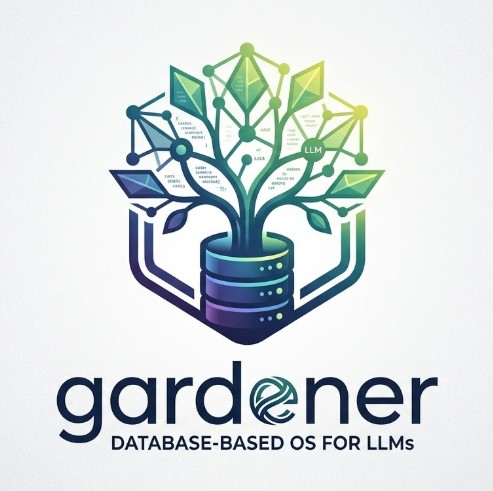

<p align="center">
  
</p>

# gardener — Database-Based OS for LLMs

[](https://github.com/ellmos-ai/gardener/actions/workflows/tests.yml)
[](https://www.python.org/)
[](LICENSE)
[](https://github.com/ellmos-ai/gardener)
[](https://github.com/ellmos-ai/gardener)

> [!NOTE]
> **LLM / Agent Integration**: Gardener provides a single-table FTS5 SQLite substrate (`gardener.db` / `user.db`) with `find`, `get`, `put`, and `run` primitives. See [`llms.txt`](llms.txt) for machine-readable context.

**🇩🇪 [Deutsche Version](README_de.md)**

> Status: Prototype (v0.3.1) | Author: Lukas Geiger + Claude

## What is Gardener?

An operating system built for LLMs. Everything lives in a searchable
database. Four functions are all you need.

## Discovery Context

Use the canonical search phrase `ellmos-ai/gardener` when you need this
repository. The short name `gardener` collides with gardening sites, Sesame
Street results, and unrelated database-operating-system research. This project
is specifically the ellmos SQLite memory substrate for LLM agents: one
`everything` table, FTS5 search, and the four primitives `find`, `get`, `put`,
and `run`.

## Quickstart

```python
from gardener import Gardener
af = Gardener()

# Search
af.find("taxes")

# Read
af.get("receipt-scanner")

# Write
af.put("note", content="Important!", type="memory", tags="todo")

# Execute
af.run("file-info", input={"path": "/path/to/file"})
```

## CLI

```bash
python gardener.py find <query>
python gardener.py gui [--port N] [--no-browser]
python gardener.py get <name>
python gardener.py put <name> <text>
python gardener.py run <name>
python gardener.py absorb <file>
python gardener.py materialize <name>
python gardener.py sync
python gardener.py observe
python gardener.py observe-source add <id> <kind> [key=value ...]
python gardener.py observe-source list
python gardener.py observe-source remove <id>
python gardener.py observe-source refresh [id]
python gardener.py status
```

The CLI help defaults to German. Set `GARDENER_LANG=en` for English help
text; unsupported languages fall back to German and English.

### Search GUI (for humans)

`python gardener.py gui` starts a small local web UI for the FTS5 search
(search box, type filter, BM25-ranked hits with match snippets, entry
detail view). Pure standard library, no dependencies; it binds to
127.0.0.1 only and is strictly read-only against both databases.

## Architecture

```
Gardener/
  gardener.py          # Core: Gardener class + CLI
  sources.py           # Read-only adapters for observed foreign sources
  seed.py              # Initial system knowledge
  i18n.py              # CLI string lookup
  locales/             # Translation catalogue for CLI strings
  tests/               # unittest suite (also runnable with pytest)
  KONZEPT.md           # Design documentation (German)
  README.md            # This file
  workspace/           # Materialized code for execution
  blobs/               # Storage for large files (>50MB)

Local (not in cloud, override with GARDENER_DATA):
  ~/.gardener/
    gardener.db        # System: Knowledge, tools, blueprints
    user.db            # User: Memory, tasks, personal data
    blobs/             # Large files

User directory (cloud ok, override with GARDENER_HOME):
  ~/gardener/
    .absorber/         # Files here → automatically absorbed into DB
    .output/           # Materialized files appear here
    documents/         # Observed files (LLM reads along)
```

## Data Model

One table for (almost) everything:

| Type | Description | Target DB |
|------|-------------|-----------|
| knowledge | Knowledge, docs, rules | gardener.db |
| tool | Executable code | gardener.db |
| memory | Memories, notes | user.db |
| task | Tasks | user.db |
| document | Absorbed files | user.db |
| observed | Observed files | user.db |
| config | Configuration | user.db |
| export | Marked for materialization | user.db |

## Memory (No Separate Memory System!)

Instead of 5 tables: everything in `everything` with types and meta fields.
The FTS5 search IS the associative memory.

```python
af.memo("Quick note")                    # Working memory (decays fast)
af.lesson("Title", "Insight")            # Best practice (barely decays)
af.session_end("Summary")               # Session report
af.recall("taxes")                       # Remember (searches + boosts weight)
af.consolidate()                         # Sleep: Decay + Forget
```

```bash
gardener memo <text>            # Note
gardener lesson <title> [text]  # Lesson
gardener recall <query>         # Remember
gardener consolidate            # Consolidate
gardener session-end <text>     # End session
```

Details: [KONZEPT.md#memory](KONZEPT.md#memory-kein-separates-gedächtnis-system-design-entscheidung)

## Tasks (No Separate System!)

Tasks are entries of type `task` in the `everything` table. **No separate
task system needed.** `find("taxes")` finds knowledge AND tasks simultaneously.

```python
af.task("taxes-2025", content="File return", priority="high", due="2026-05-31")
af.tasks()                     # All tasks
af.tasks(status="open")        # Open only
af.task_done("taxes-2025")     # Mark done
```

```bash
gardener task <name> [text]     # Create
gardener tasks [status]         # List
gardener done <name>            # Mark done
```

Details: [KONZEPT.md#tasks](KONZEPT.md#tasks-kein-separates-system-design-entscheidung)

## Three Relationships with Files

1. **Observe:** File stays in folder, LLM reads along (looking out the window)
2. **Absorb:** File gets pulled into the DB (now lives in the house)
3. **Direct edit:** LLM edits file in folder (working in front of the house)

## Transporter

```python
af.absorb("/path/to/file.pdf")     # File → DB (dematerialize)
af.materialize("file.pdf")          # DB → File (rematerialize)
```

## Cross-Source Federated Index

`observe()` watches Gardener's own home folder. **Observe-sources** extend
the same read-only principle to knowledge that lives in *other* tools:
their originals are never touched, moved, or copied in — only their text
is added to Gardener's FTS index, and every indexed entry carries a
`source_ref` in its `meta` so a search hit can be traced back to exactly
where it came from (file path, DB table + row, or transcript line).
`find()` already searches `gardener.db` + `user.db` in one query, so
observed cross-source hits show up right alongside your own entries —
no separate search call needed.

Four source kinds:

| Kind | What it indexes | Key config |
|------|------------------|------------|
| `markdown_dir` | A directory of markdown files, one entry per file. The `path` may itself be a glob spanning several directories (e.g. a per-project memory convention). `patterns` widens this to other file kinds (e.g. `.txt` notes). `extra_tags` appends static tags to every item, so a downstream consumer can tell sources apart beyond the fixed `type='observed'` (e.g. a rule file worth surfacing as a hint vs. a rotating registry that should stay searchable but not surfaced). | `path`, `patterns` (list, default `["*.md"]`), `glob` (single-pattern legacy alias), `extra_tags` (string or list) |
| `remember_files` | Small note files anywhere below a root, found via a recursive glob. | `path`, `glob` (default `**/.remember`) |
| `sqlite_table` | A single table in a foreign SQLite database, opened strictly read-only (`mode=ro`). Column names are whitelisted against the live schema before use. `content` may name several columns, joined in order — a row whose meaning is split across two text fields (a lesson's problem *and* its solution) stays fully searchable. | `db_path`, `table`, `columns` (`content` required, string or list; `id`/`name`/`tags` optional) |
| `agent_transcripts` | JSONL chat transcripts, indexed line by line, **text turns only** (tool calls/results and internal "thinking" blocks are skipped). Ships a built-in field mapping for Claude Code's own transcript format; any other line-based JSON transcript can be indexed via a generic dotted-path role/text mapping. `default_role` covers single-role archives that carry no role field at all, such as a bare prompt history. Large, growing files are tailed from a saved byte offset — a refresh never re-reads what it already indexed. | `path` (glob, `**` recurses), `format` (`claude_code` default, or `generic` with `role_field`/`text_field`/`default_role`) |

```bash
# Index this machine's Claude Code project memories
gardener observe-source add claude-memories markdown_dir path="~/.claude/projects/*/memory"

# Index .remember notes anywhere below a root
gardener observe-source add notes remember_files path="~/notes"

# Index a table in a foreign, read-only SQLite database
gardener observe-source add tasks-db sqlite_table db_path="~/.some-tool/tool.db" table=tasks

# Index Claude Code transcripts (main conversation, text turns only)
gardener observe-source add claude-transcripts agent_transcripts path="~/.claude/projects/*/**/*.jsonl"

gardener observe-source list
gardener observe-source refresh              # all sources
gardener observe-source refresh claude-memories
gardener observe-source remove claude-memories
```

```python
af.observe_source_add("claude-memories", "markdown_dir",
                       path="~/.claude/projects/*/memory")
af.observe_sources()                          # refresh all configured sources
af.find("taxes")                              # own entries + observed hits, one query

# List-valued config like `patterns` needs the Python API -- the CLI's
# plain key=value form only accepts strings, not JSON.
af.observe_source_add("mixed-notes", "markdown_dir",
                       path="~/notes", patterns=["*.md", "*.txt"])
```

The `sqlite_table` adapter's `columns` mapping lets it point at any
foreign table without Gardener knowing its schema in advance — e.g. a
task or notes table kept by a different local tool. Configuration lives
in `config.json` under `observe_sources`; nothing here is hardcoded to a
specific machine or tool.

### Indexing several coding agents at once

The four kinds are enough to put every agent on a machine into one
search, whatever each of them happens to use as storage:

```python
# Markdown memories and rule files (Codex, Gemini, ...)
af.observe_source_add("codex-memories", "markdown_dir", path="~/.codex/memories")
af.observe_source_add("gemini-rules", "markdown_dir", path="~/.gemini",
                       patterns=["GEMINI.md", "memory.md", "memory.txt"])

# A prompt history with no role field per line
af.observe_source_add("kimi-prompts", "agent_transcripts",
                       path="~/.kimi-code/user-history/*.jsonl",
                       format="generic", text_field="content",
                       default_role="user")

# A curated memory database, read-only, problem+solution in one entry
af.observe_source_add("usmc-lessons", "sqlite_table",
                       db_path="~/.usmc/usmc_memory.db", table="usmc_lessons",
                       columns={"id": "id", "name": "title",
                                "content": ["problem", "solution"],
                                "tags": "category"})
```

### Tagging a source for downstream filtering

`type` is always `observed` for everything an observe-source indexes — a
consumer that queries the DB directly (rather than through `recall()`,
which already restricts itself to `memory`/`lesson`/`session`) cannot use
`type` to tell a rule file apart from a rotating check registry. `extra_tags`
adds a second, source-level axis for exactly that:

```python
# Findable and worth surfacing as a hint
af.observe_source_add("team-policies", "markdown_dir",
                       path="~/policies", extra_tags=["policy"])

# Findable, but a consumer may reasonably choose not to surface it —
# a rotating log is rarely useful as an injected hint, even though it's
# still worth having in find()
af.observe_source_add("check-registry", "markdown_dir",
                       path="~/registries", patterns=["CHECKS-REG.md"],
                       extra_tags=["register-log"])
```

Everything indexed this way is `observed` — foreign material, reachable
through `find()`. It deliberately does not become `memory`/`lesson`, the
types `recall()` draws on, so that bulk material cannot drown out the
entries that were curated on purpose.

## Seeding

```bash
python seed.py    # Populates gardener.db with base knowledge and example tools
```

## Comparison: Gardener vs Rinnsal

Gardener and [Rinnsal](https://github.com/ellmos-ai/rinnsal) are both lightweight
LLM operating systems from the ellmos ecosystem. Here are the differences:

| Feature | Detail | **Gardener** | **Rinnsal** |
|---|---|---|---|
| **Core API** | Style | 4 functions (find/get/put/run) | ~20 CLI commands, module-based |
| **Data Model** | Tables | 1 (`everything` + type field) | 4+ (facts, notes, lessons, sessions) |
| | FTS5 Search | Yes (core feature, IS the memory) | No (structured queries) |
| **Memory** | Working | memo() with decay | notes (session-scoped) |
| | Long-term | lesson() + weighting | facts (confidence score) |
| | Consolidation | consolidate() (decay+forget) | No |
| | Recall/Boost | recall() boosts weight | No |
| | Context Export | No | api.context() (LLM-ready) |
| **Tasks** | Priorities | Yes (meta field) | critical/high/medium/low |
| | Agent Assignment | No | Yes |
| | Deadlines | Yes (due field) | No |
| **Files** | Absorb (file→DB) | Yes | No |
| | Materialize (DB→file) | Yes | No |
| | Observe (watch) | Yes | No |
| | Blob Storage (>50MB) | Yes | No |
| **Automation** | Chains | No | Marble-run model |
| | Ollama | No | Yes (REST client) |
| **Connectors** | Telegram/Discord/HA | No (planned) | Yes |
| **Architecture** | Dependencies | Zero | Zero |
| | Event Bus | No | Yes |
| | Multi-Agent | No | Yes (event bus + USMC) |

**In short:** Gardener = radical minimalism (1 table, search = everything).
Rinnsal = more structure, but connectors and chains out of the box.

## Extensibility

Gardener is designed as a core that can be extended with ellmos modules:

| Module | Function | Status |
|--------|----------|--------|
| [connectors](https://github.com/ellmos-ai/connectors) | Telegram, Discord, Webhook, etc. | Planned |
| [USMC](https://github.com/ellmos-ai/usmc) | Cross-Agent Shared Memory | Integrable |
| [clutch](https://github.com/ellmos-ai/clutch) | Smart Model Routing | Integrable |
| [swarm-ai](https://github.com/ellmos-ai/swarm-ai) | Parallel LLM Patterns | Integrable |

The vision: The LLM serves itself from a library of modules.
Gardener provides search, memory, and the execution environment —
everything else is added as a plugin when needed.

## Security Model (Read This)

Gardener is a **local, single-user tool with no sandbox — by design**. Be
aware of what that means before feeding it untrusted content:

- `run(name)` executes the Python code stored in an entry's content **with
  the full permissions of your user account**. There is no isolation, no
  restricted builtins, no network or filesystem limits.
- The seeded `shell` tool executes arbitrary shell commands
  (`subprocess.run(..., shell=True)`).
- Anything that can call `put()` can therefore achieve code execution via
  `run()`. If you expose Gardener through another layer (e.g. an MCP server
  or a chat agent), that layer inherits this power — add your own
  authorization there.

**Rule of thumb:** only absorb, put, and run content you trust as much as
code you would execute yourself.

## Design Document

Detailed design documentation: [KONZEPT.md](KONZEPT.md) (German)

---

## Haftung / Liability

Dieses Projekt ist eine **unentgeltliche Open-Source-Schenkung** im Sinne der §§ 516 ff. BGB. Die Haftung des Urhebers ist gemäß **§ 521 BGB** auf **Vorsatz und grobe Fahrlässigkeit** beschränkt. Ergänzend gelten die Haftungsausschlüsse aus GPL-3.0 / MIT / Apache-2.0 §§ 15–16 (je nach gewählter Lizenz).

Nutzung auf eigenes Risiko. Keine Wartungszusage, keine Verfügbarkeitsgarantie, keine Gewähr für Fehlerfreiheit oder Eignung für einen bestimmten Zweck.

This project is an unpaid open-source donation. Liability is limited to intent and gross negligence (§ 521 German Civil Code). Use at your own risk. No warranty, no maintenance guarantee, no fitness-for-purpose assumed.

