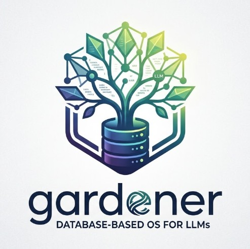

<p align="center">
  
</p>

# gardener — Database-Based OS for LLMs

**🇬🇧 [English Version](README.md)**

> Status: Prototyp | Autor: Lukas Geiger + Claude | 2026-03-12

## Was ist Gardener?

Ein Betriebssystem das für LLMs gebaut ist. Alles lebt in einer durchsuchbaren
Datenbank. Vier Funktionen reichen für alles.

## Quickstart

```python
from gardener import Gardener
af = Gardener()

# Suchen
af.find("steuer")

# Lesen
af.get("beleg-scanner")

# Schreiben
af.put("notiz", content="Wichtig!", type="memory", tags="todo")

# Ausführen
af.run("datei-info", input={"pfad": "/pfad/zur/datei"})
```

## CLI

```bash
python gardener.py find <query>
python gardener.py get <name>
python gardener.py put <name> <text>
python gardener.py run <name>
python gardener.py absorb <datei>
python gardener.py materialize <name>
python gardener.py sync
python gardener.py observe
python gardener.py status
```

## Architektur

```
Gardener/
  gardener.py          # Kern: Gardener-Klasse + CLI
  seed.py             # Initiales Systemwissen
  KONZEPT.md          # Designdokumentation
  README.md           # Diese Datei
  workspace/          # Materialisierter Code zur Ausführung
  blobs/              # Halde für große Dateien (>50MB)

Lokal (nicht in Cloud):
  AppData/Local/Gardener/
    gardener.db        # System: Wissen, Tools, Blaupausen
    user.db           # User: Memory, Tasks, persönliche Daten
    blobs/            # Große Dateien

User-Ordner (Cloud ok):
  ~/gardener/
    .absorber/        # Dateien hier → automatisch in DB absorbiert
    .output/          # Materialisierte Dateien erscheinen hier
    dokumente/        # Beobachtete Dateien (LLM liest mit)
```

## Datenmodell

Eine Tabelle für (fast) alles:

| Typ | Beschreibung | Ziel-DB |
|-----|-------------|---------|
| knowledge | Wissen, Doku, Regeln | gardener.db |
| tool | Ausführbarer Code | gardener.db |
| memory | Erinnerungen, Notizen | user.db |
| task | Aufgaben | user.db |
| document | Absorbierte Dateien | user.db |
| observed | Beobachtete Dateien | user.db |
| config | Konfiguration | user.db |
| export | Zur Materialisierung markiert | user.db |

## Memory (kein separates Gedächtnis-System!)

Statt 5 Tabellen: alles in `everything` mit Typen und Meta-Feldern.
Die FTS5-Suche IST das assoziative Gedächtnis.

```python
af.memo("Kurznotiz")                    # Working Memory (verfällt schnell)
af.lesson("Titel", "Erkenntnis")        # Best Practice (verfällt kaum)
af.session_end("Zusammenfassung")       # Session-Bericht
af.recall("steuer")                     # Erinnern (sucht + boosted Gewicht)
af.consolidate()                        # Schlaf: Decay + Forget
```

```bash
gardener memo <text>            # Notiz
gardener lesson <titel> [text]  # Lektion
gardener recall <query>         # Erinnern
gardener consolidate            # Konsolidieren
gardener session-end <text>     # Session beenden
```

Details: [KONZEPT.md#memory](KONZEPT.md#memory-kein-separates-gedaechtnis-system-design-entscheidung)

## Tasks (kein separates System!)

Tasks sind Einträge vom Typ `task` in der `everything`-Tabelle. **Kein separates
Task-System nötig.** `find("steuer")` findet Wissen UND Tasks gleichzeitig.

```python
af.task("steuer-2025", content="Einreichen", priority="high", due="2026-05-31")
af.tasks()                     # Alle Tasks
af.tasks(status="open")        # Nur offene
af.task_done("steuer-2025")    # Erledigt
```

```bash
gardener task <name> [text]     # Erstellen
gardener tasks [status]         # Auflisten
gardener done <name>            # Erledigt
```

Details: [KONZEPT.md#tasks](KONZEPT.md#tasks-kein-separates-system-design-entscheidung)

## Drei Beziehungen zu Dateien

1. **Beobachten:** Datei im Ordner, LLM liest mit (Blick aus dem Fenster)
2. **Absorbieren:** Datei wird in die DB gezogen (lebt jetzt im Haus)
3. **Direkt bearbeiten:** LLM editiert Datei im Ordner (arbeitet vor dem Haus)

## Transporter

```python
af.absorb("/pfad/zur/datei.pdf")   # Datei → DB (dematerialisieren)
af.materialize("datei.pdf")         # DB → Datei (rematerialisieren)
```

## Seeding

```bash
python seed.py    # Füllt gardener.db mit Grundwissen und Beispiel-Tools
```

## Vergleich: Gardener vs Rinnsal

Gardener und [Rinnsal](https://github.com/ellmos-ai/rinnsal) sind beide leichtgewichtige
LLM-OSes aus dem ellmos-Ökosystem. Hier die Unterschiede im Detail:

| Feature | Detail | **Gardener** | **Rinnsal** |
|---|---|---|---|
| **Kern-API** | Stil | 4 Funktionen (find/get/put/run) | ~20 CLI-Kommandos, Modul-basiert |
| **Datenmodell** | Tabellen | 1 (`everything` + Typ-Feld) | 4+ (facts, notes, lessons, sessions) |
| | FTS5 Suche | Ja (Kern-Feature, IST das Gedächtnis) | Nein (strukturierte Queries) |
| **Memory** | Working | memo() mit Decay | notes (Session-scoped) |
| | Langzeit | lesson() + Gewichtung | facts (Confidence-Score) |
| | Konsolidierung | consolidate() (Decay+Forget) | Nein |
| | Recall/Boost | recall() boostet Gewicht | Nein |
| | Context-Export | Nein | api.context() (LLM-ready) |
| **Tasks** | Prioritäten | Ja (meta-Feld) | critical/high/medium/low |
| | Agent-Zuweisung | Nein | Ja |
| | Deadlines | Ja (due-Feld) | Nein |
| **Files** | Absorb (Datei->DB) | Ja | Nein |
| | Materialize (DB->Datei) | Ja | Nein |
| | Observe (beobachten) | Ja | Nein |
| | Blob-Halde (>50MB) | Ja | Nein |
| **Automation** | Chains | Nein | Marble-Run-Modell |
| | Ollama | Nein | Ja (REST-Client) |
| **Connectors** | Telegram/Discord/HA | Nein (geplant) | Ja |
| **Architektur** | Dependencies | Zero | Zero |
| | Event-Bus | Nein | Ja |
| | Multi-Agent | Nein | Ja (Event-Bus + USMC) |

**Kurzfassung:** Gardener = radikaler Minimalismus (1 Tabelle, Suche = alles).
Rinnsal = mehr Struktur, dafür Connectors und Chains out of the box.

## Erweiterbarkeit

Gardener ist als Kern gedacht, der durch ellmos-Module erweiterbar wird:

| Modul | Funktion | Status |
|-------|----------|--------|
| [connectors](https://github.com/ellmos-ai/connectors) | Telegram, Discord, Webhook, etc. | Geplant |
| [USMC](https://github.com/ellmos-ai/usmc) | Cross-Agent Shared Memory | Integrierbar |
| [clutch](https://github.com/ellmos-ai/clutch) | Smart Model-Routing | Integrierbar |
| [swarm-ai](https://github.com/ellmos-ai/swarm-ai) | Parallele LLM-Patterns | Integrierbar |

Die Vision: Das LLM bedient sich selbst aus einer Bibliothek von Modulen.
Gardener stellt die Suche, das Gedächtnis und die Ausführungsumgebung —
alles andere kommt als Plugin dazu wenn es gebraucht wird.

## Konzept

Ausführliche Designdokumentation: [KONZEPT.md](KONZEPT.md)
