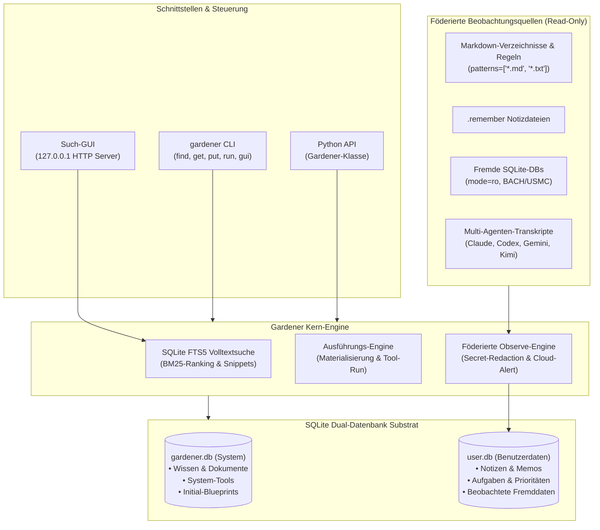

<p align="center">
  
</p>

# gardener — Database-Based OS for LLMs

[](https://github.com/ellmos-ai/gardener/actions/workflows/tests.yml)
[](https://github.com/ellmos-ai/gardener)
[](https://www.python.org/)
[](LICENSE)
[](https://github.com/ellmos-ai/gardener)
[](https://github.com/ellmos-ai/gardener)
[](https://github.com/ellmos-ai)
[](https://github.com/open-bricks)
[](llms.txt)

> [!NOTE]
> **LLM / Agenten-Integration**: Gardener stellt ein ein-Tabellen-FTS5-SQLite-Substrat (`gardener.db` / `user.db`) mit den Primitiven `find`, `get`, `put` und `run` bereit. Siehe [`llms.txt`](llms.txt) für maschinenlesbare Dokumentation.

**🇬🇧 [English Version](README.md)**

> Status: Prototyp (v0.4.0) | Autor: Lukas Geiger + Claude

## Was ist Gardener?

Ein Betriebssystem, das für LLMs gebaut ist. Alles lebt in einer durchsuchbaren
Datenbank. Vier Funktionen reichen für alles.

## Suchkontext

Nutze die kanonische Suchphrase `ellmos-ai/gardener`, wenn du dieses Repository
finden willst. Der Kurzname `gardener` kollidiert mit Garten-Webseiten,
Sesamstraße-Treffern und fremder Forschung zu database-oriented operating
systems. Dieses Projekt ist konkret das ellmos-SQLite-Gedächtnis-Substrat für
LLM-Agenten: eine `everything`-Tabelle, FTS5-Suche und die vier Primitive
`find`, `get`, `put` und `run`.

## Quickstart

```python
from gardener import Gardener
af = Gardener()

# Search
af.find("taxes")

# Read
af.get("receipt-scanner")

# Write
af.put("note", content="Important!", type="memory", tags="todo")

# Execute
af.run("file-info", input={"path": "/path/to/file"})
```

## CLI

```bash
python gardener.py find <query>
python gardener.py gui [--port N] [--no-browser]
python gardener.py get <name>
python gardener.py put <name> <text>
python gardener.py run <name>
python gardener.py absorb <file>
python gardener.py materialize <name>
python gardener.py sync
python gardener.py observe
python gardener.py observe-source add <id> <kind> [key=value ...]
python gardener.py observe-source list
python gardener.py observe-source remove <id>
python gardener.py observe-source refresh [id]
python gardener.py status
```

Die CLI-Hilfe ist standardmäßig deutsch. Mit `GARDENER_LANG=en` wird die
englische Hilfe ausgegeben; nicht unterstützte Sprachen fallen auf Deutsch
und Englisch zurück.

### Such-GUI (für Menschen)

`python gardener.py gui` startet eine schlanke lokale Weboberfläche für
die FTS5-Suche (Suchfeld, Typ-Filter, BM25-gewichtete Treffer mit
Kontext-Snippets, Detailansicht je Eintrag). Reine Standardbibliothek,
keine zusätzlichen Abhängigkeiten; bindet nur auf 127.0.0.1 und ist
streng read-only gegenüber beiden Datenbanken.

## Architektur


```mermaid
flowchart TD
    subgraph UI ["Schnittstellen & Steuerung"]
        CLI["gardener CLI<br/>(find, get, put, run, gui)"]
        API["Python API<br/>(Gardener-Klasse)"]
        GUI["Such-GUI<br/>(127.0.0.1 HTTP Server)"]
    end

    subgraph CORE ["Gardener Kern-Engine"]
        FTS["SQLite FTS5 Volltextsuche<br/>(BM25-Ranking & Snippets)"]
        EXEC["Ausführungs-Engine<br/>(Materialisierung & Tool-Run)"]
        OBS["Föderierte Observe-Engine<br/>(Secret-Redaction & Cloud-Alert)"]
    end

    subgraph SUBSTRATE ["SQLite Dual-Datenbank Substrat"]
        GDB[("gardener.db (System)<br/>• Wissen & Dokumente<br/>• System-Tools<br/>• Initial-Blueprints")]
        UDB[("user.db (Benutzerdaten)<br/>• Notizen & Memos<br/>• Aufgaben & Prioritäten<br/>• Beobachtete Fremddaten")]
    end

    subgraph SOURCES ["Föderierte Beobachtungsquellen (Read-Only)"]
        S1["Markdown-Verzeichnisse & Regeln<br/>(patterns=['*.md', '*.txt'])"]
        S2[".remember Notizdateien"]
        S3["Fremde SQLite-DBs<br/>(mode=ro, BACH/USMC)"]
        S4["Multi-Agenten-Transkripte<br/>(Claude, Codex, Gemini, Kimi)"]
    end

    CLI --> CORE
    API --> CORE
    GUI --> FTS
    CORE --> SUBSTRATE
    SOURCES --> OBS --> UDB
```

```
Gardener/
  gardener.py          # Core: Gardener class + CLI
  sources.py           # Read-only adapters for observed foreign sources
  seed.py              # Initial system knowledge
  i18n.py              # CLI string lookup
  locales/             # Translation catalogue for CLI strings
  tests/               # unittest suite (also runnable with pytest)
  KONZEPT.md           # Design documentation (German)
  README.md            # This file
  workspace/           # Materialized code for execution
  blobs/               # Storage for large files (>50MB)

Local (not in cloud, override with GARDENER_DATA):
  ~/.gardener/
    gardener.db        # System: Knowledge, tools, blueprints
    user.db            # User: Memory, tasks, personal data
    blobs/             # Large files

User directory (cloud ok, override with GARDENER_HOME):
  ~/gardener/
    .absorber/         # Files here → automatically absorbed into DB
    .output/           # Materialized files appear here
    documents/         # Observed files (LLM reads along)
```

## Datenmodell

Eine Tabelle für (fast) alles:

| Typ | Beschreibung | Ziel-DB |
|-----|-------------|---------|
| knowledge | Wissen, Doku, Regeln | gardener.db |
| tool | Ausführbarer Code | gardener.db |
| memory | Erinnerungen, Notizen | user.db |
| task | Aufgaben | user.db |
| document | Absorbierte Dateien | user.db |
| observed | Beobachtete Dateien | user.db |
| config | Konfiguration | user.db |
| export | Zur Materialisierung markiert | user.db |

## Memory (kein separates Gedächtnis-System!)

Statt 5 Tabellen: alles in `everything` mit Typen und Meta-Feldern.
Die FTS5-Suche IST das assoziative Gedächtnis.

```python
af.memo("Quick note")                    # Working memory (decays fast)
af.lesson("Title", "Insight")            # Best practice (barely decays)
af.session_end("Summary")               # Session report
af.recall("taxes")                       # Remember (searches + boosts weight)
af.consolidate()                         # Sleep: Decay + Forget
```

```bash
gardener memo <text>            # Note
gardener lesson <title> [text]  # Lesson
gardener recall <query>         # Remember
gardener consolidate            # Consolidate
gardener session-end <text>     # End session
```

Details: [KONZEPT.md#memory](KONZEPT.md#memory-kein-separates-gedächtnis-system-design-entscheidung)

## Tasks (kein separates System!)

Tasks sind Einträge vom Typ `task` in der `everything`-Tabelle. **Kein separates
Task-System nötig.** `find("steuer")` findet Wissen UND Tasks gleichzeitig.

```python
af.task("taxes-2025", content="File return", priority="high", due="2026-05-31")
af.tasks()                     # All tasks
af.tasks(status="open")        # Open only
af.task_done("taxes-2025")     # Mark done
```

```bash
gardener task <name> [text]     # Create
gardener tasks [status]         # List
gardener done <name>            # Mark done
```

Details: [KONZEPT.md#tasks](KONZEPT.md#tasks-kein-separates-system-design-entscheidung)

## Drei Beziehungen zu Dateien

1. **Beobachten:** Datei im Ordner, LLM liest mit (Blick aus dem Fenster)
2. **Absorbieren:** Datei wird in die DB gezogen (lebt jetzt im Haus)
3. **Direkt bearbeiten:** LLM editiert Datei im Ordner (arbeitet vor dem Haus)

## Transporter

```python
af.absorb("/path/to/file.pdf")     # File → DB (dematerialize)
af.materialize("file.pdf")          # DB → File (rematerialize)
```

## Cross-Source Federated Index

`observe()` beobachtet Gardeners eigenen Home-Ordner. **Observe-Sources**
erweitern dasselbe rein lesende Prinzip auf Wissen, das in *anderen*
Werkzeugen lebt: Originale werden nie angefasst, verschoben oder
hineinkopiert — nur ihr Text wird in Gardeners FTS-Index aufgenommen, und
jeder indexierte Eintrag trägt einen `source_ref` im `meta`-Feld, damit
sich ein Suchtreffer immer bis zur Quelle zurückverfolgen lässt (Dateipfad,
DB-Tabelle+Zeile, oder Transkript-Zeile). `find()` durchsucht bereits
`gardener.db` + `user.db` in einer Anfrage — beobachtete Cross-Source-
Treffer erscheinen also direkt neben den eigenen Einträgen, ohne
gesonderten Suchaufruf.

Vier Quellenarten:

| Art | Was indexiert wird | Wichtige Config |
|---|---|---|
| `markdown_dir` | Ein Verzeichnis mit Markdown-Dateien, ein Eintrag pro Datei. `path` darf selbst ein Glob sein, das mehrere Verzeichnisse abdeckt (z. B. eine Pro-Projekt-Memory-Konvention). `patterns` erweitert dies auf andere Dateiarten (z. B. `.txt`-Notizen). `exclude_patterns` entfernt Dateinamen wieder aus dem, was `patterns`/`glob` getroffen hat — z. B. ein Hilfetext-Verzeichnis, das eine kanonische Sprache plus mehrere maschinenübersetzte Geschwisterdateien mitbringt (`patterns=["*.txt"]`, `exclude_patterns=["*_en.txt", "*_es.txt"]`), wo `patterns` allein "nicht diese Endung" nicht ausdrücken kann. `extra_tags` haengt jedem Eintrag statische Tags an, damit ein nachgelagerter Konsument Quellen jenseits des festen `type='observed'` unterscheiden kann (z. B. eine Regeldatei, die als Hinweis eingeblendet werden soll, gegenueber einer rotierenden Registry, die durchsuchbar bleiben, aber nicht eingeblendet werden soll). | `path`, `patterns` (Liste, Default `["*.md"]`), `glob` (einzelnes Muster, veralteter Alias), `exclude_patterns` (Liste), `extra_tags` (String oder Liste) |
| `remember_files` | Kleine Notiz-Dateien irgendwo unterhalb einer Wurzel, gefunden über rekursives Glob. | `path`, `glob` (Default `**/.remember`) |
| `sqlite_table` | Eine einzelne Tabelle in einer fremden SQLite-Datenbank, streng lesend geöffnet (`mode=ro`). Spaltennamen werden vor Nutzung gegen das echte Schema geprüft (Whitelist). `content` darf mehrere Spalten benennen, die der Reihe nach zusammengefügt werden — eine Zeile, deren Sinn auf zwei Textfelder verteilt ist (das Problem *und* die Lösung einer Lesson), bleibt so vollständig durchsuchbar. | `db_path`, `table`, `columns` (`content` Pflicht, String oder Liste; `id`/`name`/`tags` optional) |
| `agent_transcripts` | JSONL-Chat-Transkripte, zeilenweise indexiert, **nur Text-Turns** (Tool-Aufrufe/-Ergebnisse und interne „Thinking"-Blöcke werden übersprungen). Bringt eingebaute Feld-Mappings für Claude Code, Gemini Antigravity, Codex und Kimi Transkriptformate mit; jedes andere zeilenbasierte JSON-Transkript lässt sich über ein generisches Dotted-Path-Role/Text-Mapping indexieren. `default_role` deckt Archive mit nur einer Rolle ab, die gar kein Rollenfeld führen — etwa eine reine Prompt-Historie. Große, wachsende Dateien werden ab einem gespeicherten Byte-Offset weitergelesen — ein Refresh liest nie erneut, was schon indexiert wurde. `path` darf eine **Liste** von Globs sein, und `key_by="name"` schlüsselt den Offset-Zustand am Dateinamen statt am vollen Pfad — zusammen deckt das Hosts ab, die Transkripte zwischen Ordnern *rotieren* (Codex verschiebt fertige Rollouts von `sessions/` nach `archived_sessions/`), was sonst jede verschobene Datei ein zweites Mal unter neuem Namen indexieren würde. | `path` (Glob oder Liste von Globs, `**` rekursiv), `format` (`claude_code` Default, `gemini_antigravity`, `codex`, `kimi`, oder `generic` mit `role_field`/`text_field`/`default_role`), `key_by` (`path` Default, oder `name`) |

```bash
# Index this machine's Claude Code project memories
gardener observe-source add claude-memories markdown_dir path="~/.claude/projects/*/memory"

# Index .remember notes anywhere below a root
gardener observe-source add notes remember_files path="~/notes"

# Index a table in a foreign, read-only SQLite database
gardener observe-source add tasks-db sqlite_table db_path="~/.some-tool/tool.db" table=tasks

# Index Claude Code transcripts (main conversation, text turns only)
gardener observe-source add claude-transcripts agent_transcripts path="~/.claude/projects/*/**/*.jsonl"

gardener observe-source list
gardener observe-source refresh              # all sources
gardener observe-source refresh claude-memories
gardener observe-source remove claude-memories
```

```python
af.observe_source_add("claude-memories", "markdown_dir",
                       path="~/.claude/projects/*/memory")
af.observe_sources()                          # refresh all configured sources
af.find("taxes")                              # own entries + observed hits, one query

# List-valued config like `patterns` needs the Python API -- the CLI's
# plain key=value form only accepts strings, not JSON.
af.observe_source_add("mixed-notes", "markdown_dir",
                       path="~/notes", patterns=["*.md", "*.txt"])
```

Das `columns`-Mapping des `sqlite_table`-Adapters erlaubt es, auf jede
fremde Tabelle zu zeigen, ohne dass Gardener ihr Schema vorher kennt —
z. B. eine Task- oder Notiz-Tabelle eines anderen lokalen Werkzeugs. Die
Konfiguration liegt in `config.json` unter `observe_sources`; nichts hier
ist auf eine konkrete Maschine oder ein konkretes Werkzeug festverdrahtet.

### Mehrere Coding-Agenten gemeinsam indexieren

Die vier Arten genügen, um jeden Agenten auf einer Maschine in dieselbe
Suche zu holen — unabhängig davon, was er als Speicher benutzt:

```python
# Markdown memories and rule files (Codex, Gemini, ...)
af.observe_source_add("codex-memories", "markdown_dir", path="~/.codex/memories")
af.observe_source_add("gemini-rules", "markdown_dir", path="~/.gemini",
                       patterns=["GEMINI.md", "memory.md", "memory.txt"])

# A prompt history with no role field per line
af.observe_source_add("kimi-prompts", "agent_transcripts",
                       path="~/.kimi-code/user-history/*.jsonl",
                       format="generic", text_field="content",
                       default_role="user")

# A curated memory database, read-only, problem+solution in one entry
af.observe_source_add("usmc-lessons", "sqlite_table",
                       db_path="~/.usmc/usmc_memory.db", table="usmc_lessons",
                       columns={"id": "id", "name": "title",
                                "content": ["problem", "solution"],
                                "tags": "category"})

# Transkripte, die der Host zwischen zwei Ordnern rotiert: eine Quelle
# ueber beide, am Dateinamen geschluesselt, damit eine verschobene Datei
# ihre Identitaet behaelt
af.observe_source_add("codex-sessions", "agent_transcripts",
                       path=["~/.codex/sessions/**/*.jsonl",
                             "~/.codex/archived_sessions/*.jsonl"],
                       format="codex", key_by="name")

# Transkripte, die nur im ZIP liegen: streamend gelesen, nie entpackt.
# Inkrementell je Archiv -- ein Archiv ist abgeschlossen, also ueberspringt
# unveraenderte (mtime, size) die ganze Datei, ohne sie zu oeffnen.
af.observe_source_add("gemini-archive", "agent_transcripts",
                       path="~/.gemini/antigravity/conversations_archive/*.zip",
                       format="gemini_antigravity",
                       zip_inner="*/.system_generated/logs/transcript.jsonl")
```

### Die eigene Wissensbasis eines fremden Systems indexieren

Ein lokales "OS-in-a-box"-System führt seine Dokumentation meist auf
zwei Wegen gleichzeitig: strukturierte Zeilen in seiner eigenen
SQLite-Datenbank (Wiki-Artikel, Skill-Definitionen) und einfache
Dateien auf der Platte (README/Architektur-Dokus, ein generiertes
Pro-Befehl-Hilfeverzeichnis). Beides wird `observed`, nicht absorbiert
— Gardener fasst weder die Dateien noch die DB des fremden Systems an:

```python
# Zwei Tabellen der eigenen Wissensbasis des fremden Systems
af.observe_source_add("bach-wiki", "sqlite_table",
                       db_path="~/.bach/bach.db", table="wiki_articles",
                       columns={"id": "path", "name": "title",
                                "content": "content", "tags": "category"})
af.observe_source_add("bach-skills", "sqlite_table",
                       db_path="~/.bach/bach.db", table="skills",
                       columns={"id": "id", "name": "name",
                                "content": ["description", "content"],
                                "tags": "category"})

# README-/Architektur-artige Dokus unter festen, benannten Pfaden --
# nicht-rekursive `patterns` halten einen docs/-Unterordner
# (z. B. docs/help/) von selbst draussen, ohne extra Ausschluss
af.observe_source_add("bach-system-docs", "markdown_dir",
                       path="~/OneDrive/.../BACH/system",
                       patterns=["ARCHITECTURE.md", "CHANGELOG.md",
                                 "FEATURES.md", "ROADMAP.md"])

# Ein generiertes Pro-Befehl-Hilfeverzeichnis, das pro Schluessel eine
# kanonische Sprache plus fuenf maschinenuebersetzte Geschwister
# mitbringt -- jede Sprache zu indexieren wuerde das FTS-Ranking mit
# Beinahe-Duplikaten fluten, fuer wenig Mehrwert, also bleibt nur die
# kanonische Sprache erhalten
af.observe_source_add("bach-help-de", "markdown_dir",
                       path="~/OneDrive/.../BACH/system/docs/help",
                       patterns=["*.txt"],
                       exclude_patterns=["*_en.txt", "*_es.txt",
                                         "*_ja.txt", "*_ru.txt", "*_zh.txt"])
```

### Eine Quelle suchen statt alle

Quellen unterscheiden sich um drei Grössenordnungen: Auf dieser Maschine hält
`codex-sessions` 260.000 Transkriptzeilen, `usmc-working` 518 Notizen — BM25 gibt
die ganze erste Seite also den Transkripten, und eine Fachsuche sieht aus, als
gäbe es nichts. `find()` nimmt deshalb einen Quellenfilter entgegen:

```bash
gardener find --source usmc-working store welle
gardener find --source usmc-working,usmc-facts store
gardener find --source usmc-working              # ohne Suchbegriff: Quelle auflisten
gardener find --type memory --limit 5 store      # ebenfalls neu durchgereicht
```

```python
af.find("store welle", source="usmc-working")
af.find("store", source=["usmc-working", "usmc-facts"])
af.find("", source="usmc-working", limit=50)     # auflisten, neueste zuerst
```

Der Filter ist eine `WHERE`-Bedingung auf den Namensraum `observed/<quell-id>/…`
und wirkt **vor** dem Ranking, in allen drei Stufen von `find()` (exakte
FTS-Suche, Mehrwort-ODER-Fallback, LIKE-Fallback). Eine Quell-ID matcht das ganze
Pfadsegment, `--source usmc` zieht also nicht `usmc-working` mit; ein
vorangestelltes `observed/` darf man schreiben oder weglassen. `--source` und das
Feld `source` im Ergebnis sind zweierlei — das Feld benennt die Datenbank
(`user`/`system`).

> [!NOTE]
> **Ältere Versionen ohne `--source`:** die Quell-ID als Suchwort mitgeben,
> `gardener find usmc-working store`. Eintragsnamen stehen im Volltextindex, das
> funktioniert also — es rankt nur schwächer als ein echter Filter, weil die ID
> mit den Suchbegriffen konkurriert, statt die Kandidatenmenge einzuschränken.

Das ist das Gegenstück zur Abfragezeit zu `extra_tags` weiter unten: `extra_tags`
etikettiert eine Quelle bei der Registrierung, für Konsumenten, die mehrere
Quellen unter einem Namen bündeln; `--source` verengt eine einzelne Suche auf
eine benannte Quelle und braucht keine Vorausplanung.

### Was eine Quelle niemals indexieren kann

Eine Quellen-Konfiguration richtet den Adapter auf einen beliebigen Glob —
der Schutz davor, Zugangsdaten zu indexieren, kann deshalb nicht in den
Konfigurationen liegen, sondern liegt in den Adaptern. `sources.is_excluded()`
wird pro Datei geprueft, und keine Konfiguration kann das abschalten:

- **Pfadsegmente** (ganz und case-insensitiv verglichen): `CREDENTIALS`,
  `.ssh`, `.gnupg`, `.gardener` (Gardeners eigenes Laufzeitverzeichnis),
  `node_modules`, `.git`, `.venv`/`venv`, `__pycache__`, `.absorber`,
  `.output`.
- **Dateinamen:** `.npmrc`, `.netrc`, `.pgpass`, `.env`, `auth.json`,
  `credentials.json`, `secrets.json`, `token.json`, `id_rsa`/`id_ed25519`, …
- **Endungen:** `.pem`, `.key`, `.p12`, `.pfx`, `.keystore`, `.jks`, …

Weil Segmente ganz und nicht als String-Praefix verglichen werden, ist eine
Nachbardatei namens `credentials-howto.md` *nicht* ausgeschlossen — nur ein
echtes `CREDENTIALS/`-Verzeichnis. `gardener.py` leitet seine
`observe()`/`sync()`-Ausschlussliste aus denselben Konstanten ab: eine Liste
zu pflegen, und der Home-Ordner-Lauf kann nicht von den Adaptern abdriften.

### Geheimnisse werden beim Hereinkommen geschwaerzt

Die Ausschlussliste haelt Zugangsdaten-*Dateien* draussen. Gegen einen Token,
den jemand mitten in eine Agenten-Sitzung kopiert hat, hilft sie nicht — der
Text ist Teil des Transkripts. Deshalb wird der Text selbst redigiert, und
zwar in `scan()`, dem einen Tor, durch das die Items jedes Adapters gehen:

```text
//registry.npmjs.org/:_authToken=npm_***REDACTED***
```

**Die Semantik ist gewollt: Ein Agent, der den echten Token braucht, muss zur
Quelldatei gehen. Der Index verraet, WO ein Geheimnis liegt, nie WAS es ist.**

13 Familien folgen den dokumentierten Formaten von GitHub Secret Scanning,
gitleaks und detect-secrets (Anthropic, OpenAI, GitHub-PATs, AWS-Key-IDs,
Slack, Google, GitLab, npm, `Authorization: Bearer`, PEM-Bloecke). Jedes
Muster verankert sich an fester Laenge, eingeschraenkter Zeichenklasse und —
wo der Anbieter einen liefert — einem Literal-Marker (`T3BlbkFJ`). Diese
Verankerung, nicht das Praefix, haelt Fliesstext draussen: `skalar`,
`ghpx_…`, `AKIAA`, `npm_install` und ein blosses „Bearer" im Satz bleiben
unangetastet. Entropie-Heuristiken und Schluesselwort-Detektoren sind bewusst
NICHT dabei — beide sind high-recall/low-precision, und ein Schritt, der
unbeaufsichtigt laeuft, darf nicht raten.

Eine Signatur in einer **cloud-synchronisierten** Datei (unter
`GARDENER_CLOUD_ROOT`, Default `~/OneDrive`) ist ein eigener Sicherheitsbefund,
weil der Wert das Geraet verlassen hat. Je Fund eine Zeile — Datum, Pfad,
Familie, **nie der Wert** — wird idempotent an `GARDENER_CLOUD_ALERT_FILE`
angehaengt, in den Statistiken von `observe_sources()` gezaehlt und auf stderr
gemeldet. Dieselbe Signatur in einem lokalen Transkript loest keinen Alarm
aus: sie ist nie hinausgegangen.

### Eine Quelle fuer nachgelagerte Filterung taggen

`type` ist bei allem, was eine observe-source indexiert, immer `observed` —
ein Konsument, der die DB direkt abfragt (statt ueber `recall()`, das sich
ohnehin auf `memory`/`lesson`/`session` beschraenkt), kann darueber eine
Regeldatei nicht von einer rotierenden Check-Registry unterscheiden.
`extra_tags` fuegt genau dafuer eine zweite, quellenweite Achse hinzu:

```python
# Findbar und es wert, als Hinweis eingeblendet zu werden
af.observe_source_add("team-policies", "markdown_dir",
                       path="~/policies", extra_tags=["policy"])

# Findbar, aber ein Konsument darf sich vertretbar dagegen entscheiden,
# es einzublenden -- ein rotierendes Log ist als eingeblendeter Hinweis
# selten nuetzlich, auch wenn es in find() weiter etwas wert ist
af.observe_source_add("check-registry", "markdown_dir",
                       path="~/registries", patterns=["CHECKS-REG.md"],
                       extra_tags=["register-log"])
```

Alles so Indexierte ist `observed` — fremdes Material, erreichbar über
`find()`. Es wird bewusst nicht zu `memory`/`lesson`, den Typen, aus denen
`recall()` schöpft, damit Massenmaterial die bewusst kuratierten Einträge
nicht überschwemmt.

## Seeding

```bash
python seed.py    # Populates gardener.db with base knowledge and example tools
```

## Vergleich: Gardener vs Rinnsal

Gardener und [Rinnsal](https://github.com/ellmos-ai/rinnsal) sind beide leichtgewichtige
LLM-OSes aus dem ellmos-Ökosystem. Hier die Unterschiede im Detail:

| Feature | Detail | **Gardener** | **Rinnsal** |
|---|---|---|---|
| **Kern-API** | Stil | 4 Funktionen (find/get/put/run) | ~20 CLI-Kommandos, Modul-basiert |
| **Datenmodell** | Tabellen | 1 (`everything` + Typ-Feld) | 4+ (facts, notes, lessons, sessions) |
| | FTS5 Suche | Ja (Kern-Feature, IST das Gedächtnis) | Nein (strukturierte Queries) |
| **Memory** | Working | memo() mit Decay | notes (Session-scoped) |
| | Langzeit | lesson() + Gewichtung | facts (Confidence-Score) |
| | Konsolidierung | consolidate() (Decay+Forget) | Nein |
| | Recall/Boost | recall() boostet Gewicht | Nein |
| | Context-Export | Nein | api.context() (LLM-ready) |
| **Tasks** | Prioritäten | Ja (meta-Feld) | critical/high/medium/low |
| | Agent-Zuweisung | Nein | Ja |
| | Deadlines | Ja (due-Feld) | Nein |
| **Files** | Absorb (Datei->DB) | Ja | Nein |
| | Materialize (DB->Datei) | Ja | Nein |
| | Observe (beobachten) | Ja | Nein |
| | Blob-Halde (>50MB) | Ja | Nein |
| **Automation** | Chains | Nein | Marble-Run-Modell |
| | Ollama | Nein | Ja (REST-Client) |
| **Connectors** | Telegram/Discord/HA | Nein (geplant) | Ja |
| **Architektur** | Dependencies | Zero | Zero |
| | Event-Bus | Nein | Ja |
| | Multi-Agent | Nein | Ja (Event-Bus + USMC) |

**Kurzfassung:** Gardener = radikaler Minimalismus (1 Tabelle, Suche = alles).
Rinnsal = mehr Struktur, dafür Connectors und Chains out of the box.

## Erweiterbarkeit

Gardener ist als Kern gedacht, der durch ellmos-Module erweiterbar wird:

| Modul | Funktion | Status |
|-------|----------|--------|
| [connectors](https://github.com/ellmos-ai/connectors) | Telegram, Discord, Webhook, etc. | Geplant |
| [USMC](https://github.com/ellmos-ai/usmc) | Cross-Agent Shared Memory | Integrierbar |
| [clutch](https://github.com/ellmos-ai/clutch) | Smart Model-Routing | Integrierbar |
| [swarm-ai](https://github.com/ellmos-ai/swarm-ai) | Parallele LLM-Patterns | Integrierbar |

Die Vision: Das LLM bedient sich selbst aus einer Bibliothek von Modulen.
Gardener stellt die Suche, das Gedächtnis und die Ausführungsumgebung —
alles andere kommt als Plugin dazu wenn es gebraucht wird.

### Geschwisterwerkzeuge & Ökosystem

Gardener ist Teil der **ellmos-ai**- und **open-bricks**-Ökosysteme für modulare, lokale LLM-Werkzeuge:

| Repository | Schwerpunkt / Beschreibung | Kategorie |
|---|---|---|
| [ellmos-core](https://github.com/ellmos-ai/ellmos-core) | Modularer Agenten-Ausführungskern & Prompt-Evidence-Engine | Kern-Framework |
| [clutch](https://github.com/ellmos-ai/clutch) | Universeller Multi-Provider LLM-CLI-Client (Anthropic, Gemini, OpenAI, Ollama) | CLI & Routing |
| [BACH](https://github.com/ellmos-ai/bach) | Dateizentriertes textbasiertes Betriebssystem für LLMs (Dateisystem-Substrat) | OS-Architektur |
| [USMC](https://github.com/ellmos-ai/usmc) | Universal Shared Memory Core zur Multi-Agenten-Zustandspersistenz | Gedächtnis-Substrat |
| [Rinnsal](https://github.com/ellmos-ai/rinnsal) | Leichtgewichtige, strukturierte, eventbasierte Agenten-Infrastruktur | Agenten-Laufzeit |
| [ellmos-controlcenter-mcp](https://github.com/ellmos-ai/ellmos-controlcenter-mcp) | Zentrale MCP-Tool-Koordination, Profilverwaltung & dynamisches Routing | MCP-Gateway |
| [ellmos-filecommander-mcp](https://github.com/ellmos-ai/ellmos-filecommander-mcp) | Lokale Dateioperationen, sichere Papierkorb-Löschung & zweisprachiger MCP-Server | MCP-Server |
| [ellmos-codecommander-mcp](https://github.com/ellmos-ai/ellmos-codecommander-mcp) | AST-Analyse, Code-Transformation & Refactoring-MCP-Server | MCP-Server |
| [ellmos-clatcher-mcp](https://github.com/ellmos-ai/ellmos-clatcher-mcp) | Strukturierter Scratchpad-, Validierungs- & State-Caching-MCP-Server | MCP-Server |
| [n8n-manager-mcp](https://github.com/ellmos-ai/n8n-manager-mcp) | Lokale n8n-Workflow-Verwaltung und Workflow-Inspektions-MCP-Server | MCP-Server |
| [skills](https://github.com/ellmos-ai/skills) | Kuratierter Multi-Agenten-Skill-Katalog und Ausführungsfabric | Skill-Bibliothek |
| [DevCenter](https://github.com/dev-bricks/DevCenter) | Entwickler-Arbeitsplatz-Orchestrierung und -Verwaltung | Entwickler-Tools |
| [open-bricks](https://github.com/open-bricks) | Dachorganisation für modulare Open-Source-Bausteine | Ökosystem-Dach |

## Sicherheitsmodell (bitte lesen)

Gardener ist ein **lokales Single-User-Werkzeug ohne Sandbox — bewusst so
entworfen**. Vor dem Verfüttern von nicht vertrauenswürdigem Inhalt sollte
klar sein, was das bedeutet:

- `run(name)` führt den in einem Eintrag gespeicherten Python-Code **mit den
  vollen Rechten des eigenen Benutzerkontos** aus. Keine Isolation, keine
  eingeschränkten Builtins, keine Netzwerk- oder Dateisystem-Limits.
- Das mitgelieferte Seed-Tool `shell` führt beliebige Shell-Befehle aus
  (`subprocess.run(..., shell=True)`).
- Alles, was `put()` aufrufen kann, kann über `run()` Code ausführen. Wer
  Gardener über eine weitere Schicht exponiert (z. B. einen MCP-Server oder
  einen Chat-Agenten), vererbt diese Macht — Autorisierung gehört in diese
  Schicht.

**Faustregel:** Nur Inhalte absorbieren, putten und ausführen, denen man so
vertraut wie eigenem Code.

## Konzept

Ausführliche Designdokumentation: [KONZEPT.md](KONZEPT.md)

---

## Haftung / Liability

Dieses Projekt ist eine **unentgeltliche Open-Source-Schenkung** im Sinne der §§ 516 ff. BGB. Die Haftung des Urhebers ist gemäß **§ 521 BGB** auf **Vorsatz und grobe Fahrlässigkeit** beschränkt. Ergänzend gelten die Haftungsausschlüsse aus GPL-3.0 / MIT / Apache-2.0 §§ 15–16 (je nach gewählter Lizenz).

Nutzung auf eigenes Risiko. Keine Wartungszusage, keine Verfügbarkeitsgarantie, keine Gewähr für Fehlerfreiheit oder Eignung für einen bestimmten Zweck.

This project is an unpaid open-source donation. Liability is limited to intent and gross negligence (§ 521 German Civil Code). Use at your own risk. No warranty, no maintenance guarantee, no fitness-for-purpose assumed.
